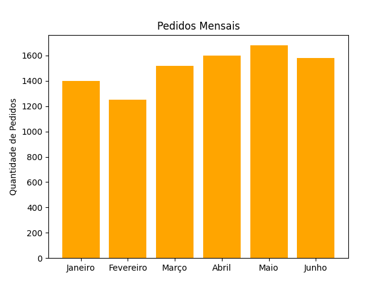
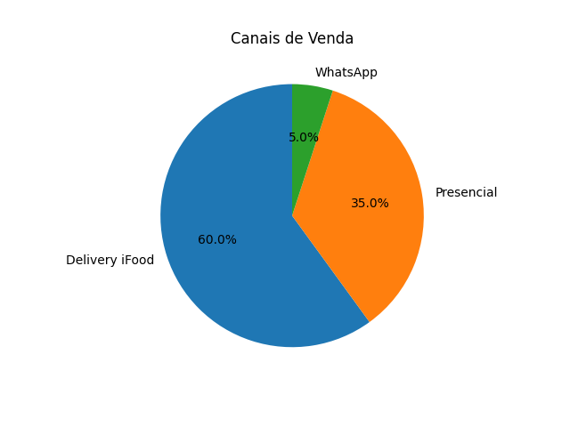

# Dashboard Big Hangus Hamburgueria - Parelhas RN

## 📊 Indicadores Gerais
- **Faturamento (Junho):** R$ 39,500.00
- **Pedidos (Junho):** 1580
- **Avaliação Média:** ⭐ 4.5/5

##  Faturamento Mensal

##  Pedidos por Mês

##  Produtos Mais Vendidos

##  Canais de Venda

>Insights para Decisão

Delivery via app (60% das vendas) → investir em promoções e cupons no iFood.

Pedidos presenciais (35%) → possibilidade de aumentar vendas oferecendo combos exclusivos na loja.

WhatsApp (5%) → oportunidade de criar campanhas de fidelização para clientes recorrentes.

Avaliação 4.5/5 → ótimo resultado, com margem de melhora, com foco em tempo de entrega e experiência presencial.
